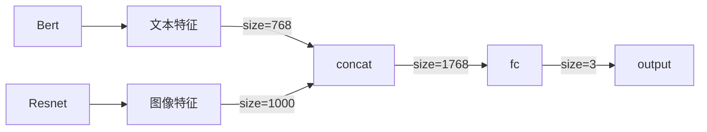
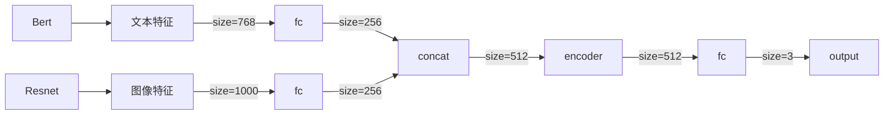

# 多模态情感分析实验报告

## 项目概述

介绍：本次任务为三分类任务，通过给出的图像数据和文本数据，建立一个多模态模型，进行情感分析，输出结果为三种情感的预测（positive，negative, neutral）

模型：对于图像数据，我们使用torchvision中预训练的ResNet18和DenseNet121，对于文本数据，我们采用Huggingface的预训练Bert模型。对于模型的融合方法，分别使用了简单拼接的方法和基于注意力机制的融合方法

## 实验过程

### 一、处理数据集

#### 1. 加载数据集

训练集和测试集的标识汇总于`train.txt`和`test_without_label.txt`中，我们首先将这两个文件加载为dataframe的格式，并统计每种分类的样本数如下:

| 类别     | 样本数 |
| -------- | ------ |
| positive | 2388   |
| negative | 1193   |
| neutral  | 419    |

可以发现样本存在类别不平衡的问题，接着我们将训练集按照8：2的比例划分为训练集和验证集：

```python
train_samples, val_samples = train_test_split(
    samples, test_size=0.2, random_state=SEED
)
```

此时各集合的样本数如下：

|      | 训练集样本数 | 验证集样本数 | 测试集样本数 |
| ---- | ------------ | ------------ | ------------ |
| 数量 | 3200         | 800          | 511          |

接着我们依次根据guid读取对应的文本和图像数据

##### 1.1 处理文本数据

通过观察可以发现，文本数据包含大量无意义的#字符，遂将其去除: `txt = txt.replace("#", "")`

另外部分文本存在乱码的情况，实际为编码格式的不同，对此我们统一使用gb18030编码读取，它覆盖了中日韩等字符

另外，由于我们要将文本数据传入给Bert模型，因此我们需要将文本进行编码，直接使用transformers库中的BertTokenizer即可:

```python
txt = self.tokenizer.encode(txt, add_special_tokens=True)
```

这将把文本返回为整数编码列表，并在前后加上[CLS]和[SEP]标识符

##### 1.2 处理图像数据

对于图像数据，为适应模型的输入，我们需要将其Resize为224\*224的大小:

```python
img = Image.open(f"{dataset_loc}/data/{guid}.jpg")
transform = transforms.Compose(
    [
        transforms.Resize(224),
        transforms.CenterCrop(224),
        transforms.ToTensor(),
    ]
)
img = transform(img)
```

#### 2. 转换为Dataloader

接着我们将数据集转换为pytorch可以识别的Dataloader形式，首先我们创建一个可遍历的数据集类，将上述流程写入其中

同时由于文本数据的长度并不相同，我们还需要对其进行padding。定义整理函数，将每批次的文本按照最大长度进行padding，同时给出mask矩阵来让bert忽视padding部分:

```python
for t in txt:
    padded = t + [0] * (max_len - len(t))
    mask = [1] * len(t) + [0] * (max_len - len(t))
    padded_txt.append(padded)
    txt_mask.append(mask)
```

最后依次转为dataloader的形式：

```python
self.train_loader = DataLoader(train_data, batch_size=self.batch_size, collate_fn=self._collate_fn)
self.val_loader = DataLoader(val_data, batch_size=self.batch_size, collate_fn=self._collate_fn)
self.test_loader = DataLoader(test_data, batch_size=self.batch_size, collate_fn=self._collate_fn)
```

### 二、定义模型

模型融合的架构包括提前融合、推迟融合、多阶段融合等，最简单的就是第二种方式，即提取特征后再融合

而融合方式也有多种，本次实验采用的方式如下：

#### 1. 简单拼接

以Bert和Resnet为例，我们定义的模型结构如下：



对于文本数据，我们提取bert的CLS向量作为文本特征，前向传播过程如下：

```python
img = self.img_model(img)
txt = self.txt_model(input_ids=txt, attention_mask=txt_mask)  # type: ignore
txt = txt.last_hidden_state[:, 0, :]  # CLS vector
txt.view(txt.shape[0], -1)

out = torch.cat((txt, img), dim=-1)
out = self.fc(out)
```

#### 2. 基于注意力的融合

我们利用transformer结构的encoder层来添加自注意力机制，即在简单拼接后，再经过encoder层来获得对不同信息的关注程度，增强模型的互补性，结构定义如下：



encoder 层定义如下：

```python
self.transformer_encoder = nn.TransformerEncoder(
    encoder_layer=nn.TransformerEncoderLayer(
        d_model=512,
        nhead=4,
        dim_feedforward=512,
        dropout=0.4,
    ),
    num_layers=2,
)
```

#### 3. 消融实验

通过传递变量ablate来控制是否为 img only 还是 txt only，实际为resnet/densnet/bert的单独训练:

```python
if ablate == 0:  # both
    img = self.img_model(img)
    txt = self.txt_model(input_ids=txt, attention_mask=txt_mask)  # type: ignore
    txt = txt.last_hidden_state[:, 0, :]  # CLS vector
    txt.view(txt.shape[0], -1)

    out = torch.cat((txt, img), dim=-1)
    out = self.fc(out)
elif ablate == 1:  # img only
    img = self.img_model(img)
    out = self.only_img_fc(img)
else:  # txt only
    txt = self.txt_model(input_ids=txt, attention_mask=txt_mask)  # type: ignore
    txt = txt.last_hidden_state[:, 0, :]  # CLS vector
    txt.view(txt.shape[0], -1)
    out = self.only_txt_fc(txt)
```

### 三、训练过程

为保证结果的可复现性，我们固定随机种子：

```python
def set_seed(seed):
    random.seed(seed)
    np.random.seed(seed)
    torch.manual_seed(seed)
    torch.cuda.manual_seed_all(seed)
    torch.backends.cudnn.deterministic = True
```

训练过程中，我们定义损失函数为交叉熵损失函数，优化器为AdamW

同时，我们添加早停技术，根据验证集的准确率来判断是否终止训练，设置阈值为3

我们保存在验证集上准确率最高的模型，并使用这个模型作为最终模型

## 实验结果

经过调整，我们设置学习率为**1e-5**，batch_size为**16**，以准确率、精确率、召回率、F1-score作为指标，对各个模型进行横向对比，结果如下：

|                                | 准确率  | 精确率  | 召回率  | F1      |
| ------------------------------ | ------- | ------- | ------- | ------- |
| 基于简单拼接的Bert和Resnet     | 0.6950   | 0.6823 | 0.6950 | 0.6864 |
| 基于注意力机制的Bert和Resnet   | 0.6963 | 0.6904 | 0.6963 |  |
| 基于简单拼接的Bert和Densenet   | Item2.3 | Item3.3 | Item4.3 | Item5.3 |
| 基于注意力机制的Bert和Densenet | Item2.4 | Item3.4 | Item4.4 | Item5.4 |
