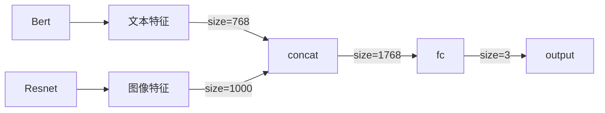
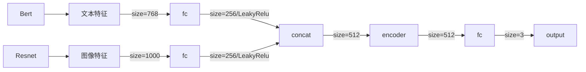
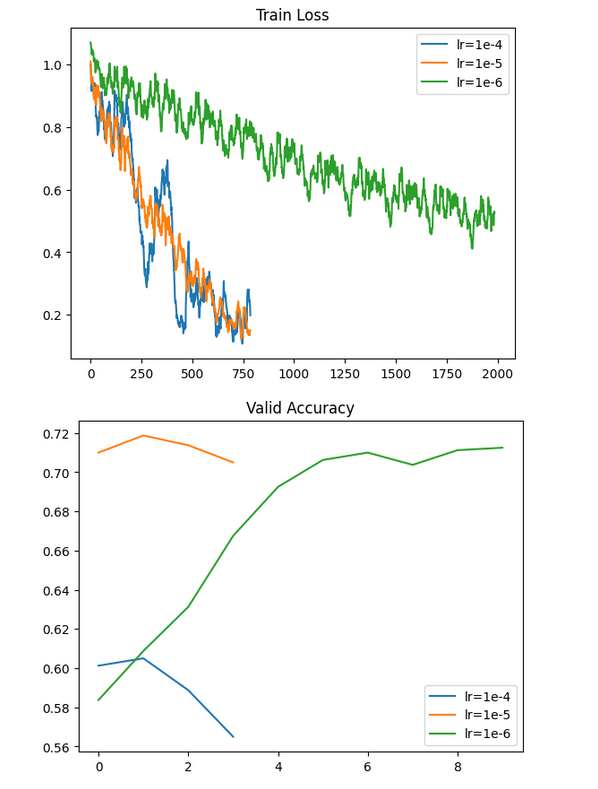
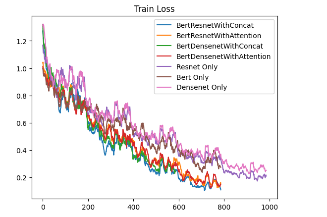
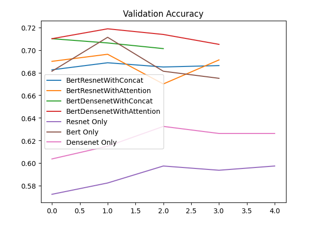

[TOC]

# 多模态情感分析实验报告

## 项目概述

本次项目Github地址：https://github.com/GentleCold/multimodal_sentiment_analysis

介绍：本次任务为三分类任务，通过给出的图像数据和文本数据，建立一个多模态模型，进行情感分析，输出结果为三种情感的预测（positive，negative, neutral）

模型：对于图像数据，我们使用torchvision中预训练的ResNet18和DenseNet121，对于文本数据，我们采用Huggingface的预训练Bert模型。对于模型的融合方法，分别使用了简单拼接的方法和基于注意力机制的融合方法

## 实验过程

### 一、处理数据集

#### 1. 加载数据集

训练集和测试集的标识汇总于`train.txt`和`test_without_label.txt`中，我们首先将这两个文件加载为dataframe的格式，并统计每种分类的样本数如下:

| 类别     | 样本数 |
| -------- | ------ |
| positive | 2388   |
| negative | 1193   |
| neutral  | 419    |

可以发现样本存在类别不平衡的问题，接着我们将训练集按照8：2的比例划分为训练集和验证集：

```python
train_samples, val_samples = train_test_split(
    samples, test_size=0.2, random_state=SEED
)
```

此时各集合的样本数如下：

|      | 训练集样本数 | 验证集样本数 | 测试集样本数 |
| ---- | ------------ | ------------ | ------------ |
| 数量 | 3200         | 800          | 511          |

接着我们依次根据guid读取对应的文本和图像数据

##### 1.1 处理文本数据

通过观察可以发现，文本数据包含大量无意义的#字符，遂将其去除: `txt = txt.replace("#", "")`

另外部分文本存在乱码的情况，实际为编码格式的不同，对此我们统一使用gb18030编码读取，它覆盖了中日韩等字符

另外，由于我们要将文本数据传入给Bert模型，因此我们需要将文本进行编码，直接使用transformers库中的BertTokenizer即可:

```python
txt = self.tokenizer.encode(txt, add_special_tokens=True)
```

这将把文本返回为整数编码列表，并在前后加上[CLS]和[SEP]标识符

##### 1.2 处理图像数据

对于图像数据，为适应模型的输入，我们需要将其Resize为224\*224的大小:

```python
img = Image.open(f"{dataset_loc}/data/{guid}.jpg")
transform = transforms.Compose(
    [
        transforms.Resize(224),
        transforms.CenterCrop(224),
        transforms.ToTensor(),
    ]
)
img = transform(img)
```

#### 2. 转换为Dataloader

接着我们将数据集转换为pytorch可以识别的Dataloader形式，首先我们创建一个可遍历的数据集类，将上述流程写入其中

同时由于文本数据的长度并不相同，我们还需要对其进行padding。定义整理函数，将每批次的文本按照最大长度进行padding，同时给出mask矩阵来让bert忽视padding部分:

```python
for t in txt:
    padded = t + [0] * (max_len - len(t))
    mask = [1] * len(t) + [0] * (max_len - len(t))
    padded_txt.append(padded)
    txt_mask.append(mask)
```

最后依次转为dataloader的形式：

```python
self.train_loader = DataLoader(train_data, batch_size=self.batch_size, collate_fn=self._collate_fn)
self.val_loader = DataLoader(val_data, batch_size=self.batch_size, collate_fn=self._collate_fn)
self.test_loader = DataLoader(test_data, batch_size=self.batch_size, collate_fn=self._collate_fn)
```

### 二、定义模型

模型融合的架构包括提前融合、推迟融合、多阶段融合等，最简单的就是第二种方式，即提取特征后再融合

而融合方式也有多种，本次实验采用的方式如下：

#### 1. 简单拼接

以Bert和Resnet为例，我们定义的模型结构如下：



对于文本数据，我们提取bert的CLS向量作为文本特征，前向传播过程如下：

```python
img = self.img_model(img)
txt = self.txt_model(input_ids=txt, attention_mask=txt_mask)  # type: ignore
txt = txt.last_hidden_state[:, 0, :]  # CLS vector
txt.view(txt.shape[0], -1)

out = torch.cat((txt, img), dim=-1)
out = self.fc(out)
```

#### 2. 基于注意力的融合

我们利用transformer结构的encoder层来添加自注意力机制，即在简单拼接后，再经过encoder层来获得对不同信息的关注程度，增强模型的互补性，同时为文本和图像特征分别添加fc层，并添加leakyRelu作为激活函数，结构定义如下：



经过合适调整，encoder 层定义如下：

```python
self.transformer_encoder = nn.TransformerEncoder(
    encoder_layer=nn.TransformerEncoderLayer(
        d_model=512,
        nhead=4,
        dim_feedforward=512,
        dropout=0.4,
    ),
    num_layers=2,
)
```

#### 3. 消融实验

通过传递变量ablate来控制是否为 img only 还是 txt only，实际为resnet/densnet/bert的单独训练:

```python
if ablate == 0:  # both
    img = self.img_model(img)
    txt = self.txt_model(input_ids=txt, attention_mask=txt_mask)  # type: ignore
    txt = txt.last_hidden_state[:, 0, :]  # CLS vector
    txt.view(txt.shape[0], -1)

    out = torch.cat((txt, img), dim=-1)
    out = self.fc(out)
elif ablate == 1:  # img only
    img = self.img_model(img)
    out = self.only_img_fc(img)
else:  # txt only
    txt = self.txt_model(input_ids=txt, attention_mask=txt_mask)  # type: ignore
    txt = txt.last_hidden_state[:, 0, :]  # CLS vector
    txt.view(txt.shape[0], -1)
    out = self.only_txt_fc(txt)
```

### 三、训练过程

为保证结果的可复现性，我们固定随机种子：

```python
def set_seed(seed):
    random.seed(seed)
    np.random.seed(seed)
    torch.manual_seed(seed)
    torch.cuda.manual_seed_all(seed)
    torch.backends.cudnn.deterministic = True
```

训练过程中，我们定义损失函数为交叉熵损失函数，优化器为AdamW

同时，我们添加早停技术，根据验证集的准确率来判断是否终止训练，设置阈值为2

我们保存在验证集上准确率最高的模型，并使用这个模型作为最终模型

### 四、学习率调整

我们分别调整学习率为1e-4、1e-5、1e-6，以BertDensenetWithAttention模型为例，得到不同学习率条件下训练集损失变化和验证集准确率变化如下：



可以看到学习率较小时收敛较慢，较大时容易陷入局部最优，综合考虑选择学习率为1e-5

## 实验结果

### 一、模型间横向对比

经过合适调整，我们设置学习率为**1e-5**，batch_size为**16**，以准确率、精确率、召回率、F1-score作为指标，对各个模型进行横向对比，结果如下：

|                                | 准确率     | 精确率     | 召回率     | F1         |
| ------------------------------ | ---------- | ---------- | ---------- | ---------- |
| 基于简单拼接的Bert和Resnet     | 0.6888     | 0.5888     | 0.5602     | 0.5638     |
| 基于注意力机制的Bert和Resnet   | 0.6963     | 0.6165     | 0.5536     | 0.5608     |
| 基于简单拼接的Bert和Densenet   | 0.7100     | 0.6208     | 0.5582     | 0.5564     |
| 基于注意力机制的Bert和Densenet | **0.7188** | **0.6434** | **0.5804** | **0.5842** |

消融实验结果如下：

|               | 准确率     | 精确率     | 召回率     | F1         |
| ------------- | ---------- | ---------- | ---------- | ---------- |
| Resnet only   | 0.5975     | 0.4979     | 0.4569     | 0.4683     |
| Densenet only | 0.6325     | 0.5072     | 0.4721     | 0.4810     |
| Bert only     | **0.7113** | **0.6692** | **0.5612** | **0.5741** |

从结果可以看出:

- 基于注意力机制的Bert和Densenet组合获得了最好的效果
- 基于注意力机制融合比简单拼接融合有更好的效果

而对于消融实验来说:

- Densenet的表现比Resnet更优，因为Densenet相对Resnet来说使用了密集连接的方式，可以更好的传递特征
- 单独Bert模型的表现仍然较好，甚至好于融合的多模态模型，而对于单独的Resnet和Densenet模型来说则表现不佳。说明文本数据对情绪判断的作用较大，而仅有图片数据则无法较好的判断。另外由于数据集数量较小的原因，对于多模态模型存在过拟合的问题，导致验证集表现不佳

### 二、训练集损失和验证集准确率变化

训练集损失随每批次训练变化如下：



从图片可以看出：

- 多模态模型都有较好的收敛，而单独的模型收敛不佳，但这也导致过拟合的问题，使得部分多模态模型在验证集上的表现不如单Bert模型
- 使用基于注意力机制融合的模型收敛速度相较简单拼接来说慢一些，但最终的收敛程度差不多，因为模型要额外学习到对图片特征和文本特征的注意力权重，最终的表现也更好一些

验证集准确率随训练次数变化如下：



从图片可以看出：

- 多数模型在训练两轮后就能在验证集上获得最好的准确率效果，而单独的图片模型需要三轮

## 总结

### 一、设计的模型总结

本次实验最终选择基于注意力机制的Bert和Densenet的模型，并用其生成测试集预测文件，位于`./output/test_with_predict.txt`

关于模型设计，最开始选择了Bert和Resnet预训练模型，一方面，Bert是基于Transformer架构的预训练模型，可以通过微调的方式轻松将其运用到下游任务并获得较好的效果，另一方面，Resnet属于深度卷积神经网络，其残差块解决梯度消失问题并支持更深的网络，可以学习到更多的特征，同时也具有良好的迁移学习性能

在模型融合上，一开始仅使用简单拼接的方式，但是这样直接的拼接可能会引入特征之间的冗余和噪声，另外不同的维度也会导致对两者的倾向性不同

于是在此基础上改进，首先将提取到的文本和图片特征分别映射到相同维度，并添加激活函数，再进行拼接，以保证拼接后的特征图片与文本各占一半，之后通过自注意力机制训练出注意力权重，从而提取到真正重要的特征，这样可以让两者进行更好的互补

最后，我们用Densenet替换Resnet模型，因为Densenet的密集连接可以减少信息丢失，更适合较小的数据集

模型亮点总结：

- 使用热门的Bert/Resnet/Densenet预训练模型进行迁移学习
- 将图片特征和文本特征映射到相同维度以减少倾向性
- 使用自注意力机制进行特征融合

### 二、遇到的BUG总结

括号内为解决办法：

- 部分文本数据乱码（统一使用gb18030编码读取）
- 输入的文本数据长度不匹配/使用torch自带的padding方法失败（添加整理函数并自行实现填充过程，同时还要实现掩码矩阵）
- 使用torch自带的Dataset类构建的数据集因为数据长度不一致无法被加载（改为支持不同长度数据的IterableDataset）
- 模型在训练集上难以收敛（往前的训练一般设置学习率为1e-3，但这次需要改变学习率为1e-5来让模型更好的收敛）
- 将数据处理部分写在`__iter__`部分导致数据重复加载（重构数据处理部分，统一将数据提前加载，提升训练效率）

### 三、知识总结

本次实验搭建了Bert/Resnet/Densenet的预训练模型进行迁移学习，了解了迁移学习的流程，以及如何处理数据集以传入这些模型。然后了解到多模态模型融合的不同方法，从最简单的直接拼接，到之后添加自注意力层来进行更好的融合。最后根据数据集的大小和验证集的表现选择合适的模型，为测试集做出预测，从而了解整个多模态模型的搭建过程
